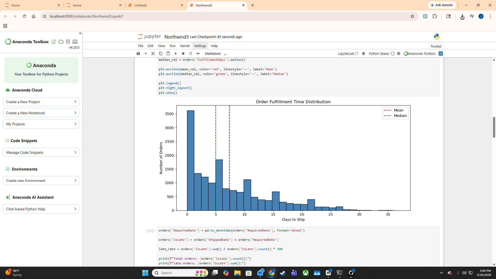
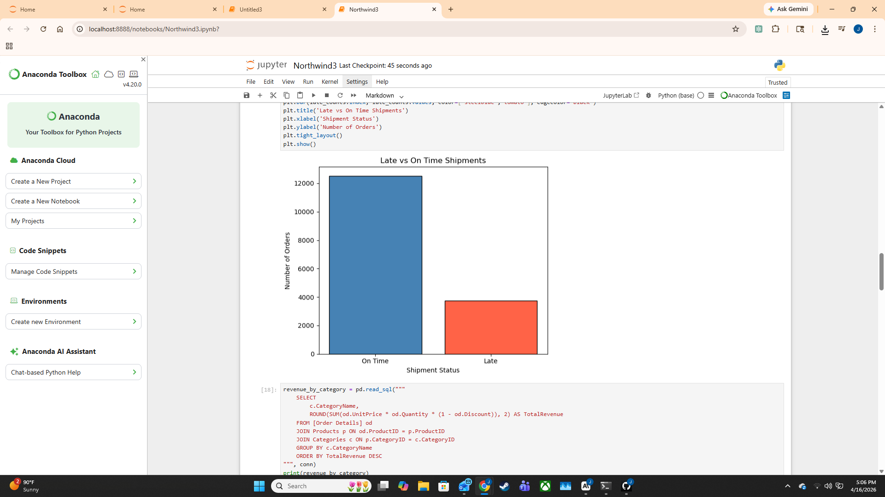
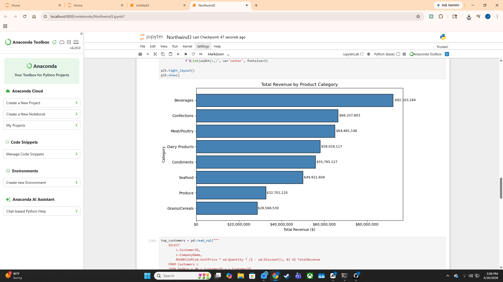
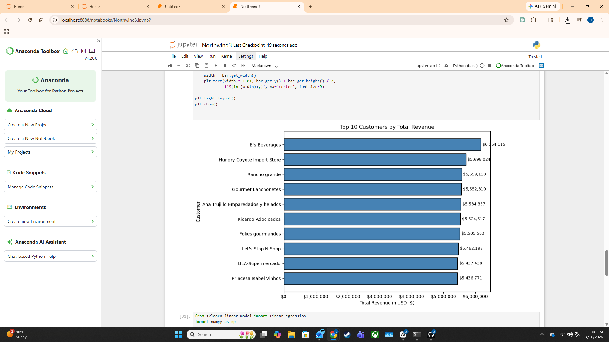
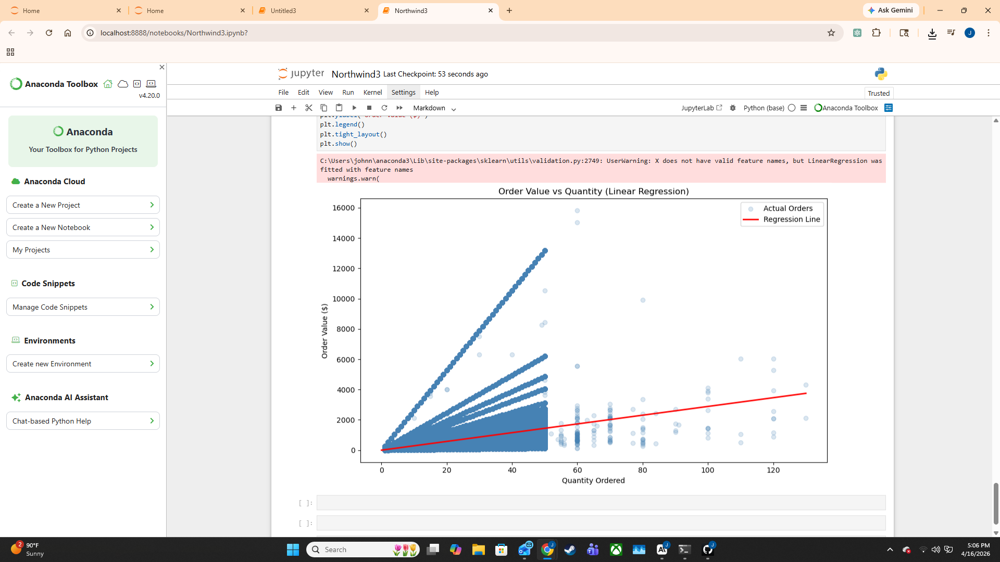

## Northwind ERP Supply Chain  Data Analysis


Exploratory analysis of order fulfillment, late shipments, revenue distribution, and customer value using a normalized relational dataset modeled after SAP/Oracle ERP schemas. Independently designed and executed.


## Approach


Analyzed 16,261 historical orders across the Northwind dataset (SQLite, ERP-style schema) to surface supply chain performance metrics and revenue patterns. Five analytical lenses: fulfillment timing, on-time delivery rate, product-category revenue mix, customer concentration, and order-value drivers.


## How to Run


Open `notebooks/northwind_analysis.ipynb` → Cell → Run All.


## Key Findings


### Order Fulfillment

- **Average fulfillment time:** 7.4 days across 16,261 orders

- **High variance:** standard deviation of 6.8 days, max 37 days, min 0 days — indicating inconsistent supply chain performance

- **Median (5 days) < mean (7.4 days):** a tail of very slow orders is dragging the average up, masking typical performance

- **Implication:** fulfillment process is not effectively standardized; root-cause investigation warranted on the long-tail orders





### Late Shipments

- **23% of orders were late** — nearly 1 in 4

- **18 percentage points above** the commonly accepted industry benchmark

- **Implication:** significant operational gap; targeted intervention on shipping reliability is high-value





### Revenue by Product Category

- **Beverages dominate at $92M**, nearly 40% above second-place Confections ($66M)

- **Grains/Cereals is the weakest category at $28M** — suggests low demand, weak sales execution, or unfavorable cost structure

- **Wide spread between top and bottom categories** suggests inventory investment is skewed toward top performers (intentionally or otherwise)





### Top 10 Customers

- **B's Beverages leads at $6.15M** — notably a beverage company concentrated in the most profitable category

- **Tight top-10 grouping:** only $700K gap between #1 and #10

- **No single customer dominates** — healthy diversification and low concentration risk





### Order Value vs Quantity (Linear Regression)

- **R² = 0.15** — quantity explains only 15% of order value

- **Each additional unit ordered adds $28.85** in value on average

- **Pricing strategy drives revenue more than volume.** The scatter reveals distinct pricing tiers per product, meaning *what* is ordered matters more than *how much*





## Dataset


Northwind SQLite database — a normalized relational dataset modeled after real ERP schemas (SAP, Oracle). Order header and line-item tables, customer master, product master, employee, and shipping tables.


## Stack


Python, pandas, matplotlib, scikit-learn, SQLite.


## Repository

```

data/        northwind.db

notebooks/   northwind_analysis.ipynb

images/      finding visualizations

README.md

```

